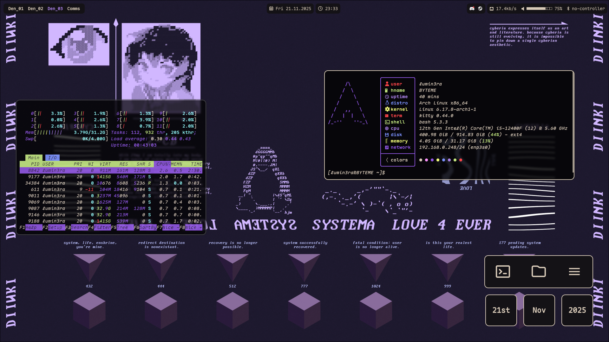

# Retro-Futuristic Linux Rice
this project is based on [a rice by diinki](https://github.com/diinki/diinki-retrofuture.git)

---

Screenshot - general

Screenshot - Special Workspace

### Installation
note: instructions are arch/arch based specific
##### Required programs
- Run `sudo pacman -S hyprpaper kitty waybar wob yazi polkit-kde-agent nemo nautilus vscode fastfetch pavucontrol hyprshot hyprlock`
- Run `yay -S eww hyprwat walker elephant elephant-desktopapplications elephant-calc maplemono-ttf zen-browser-bin`
##### Configuration files
- Run `git clone https://github.com/Lumin3ra/lumi-retrofuture.git`
- Copy all folders in `lumi-retrofuture/config` to your local user's `.config` directory
- Copy `lumi-retrofuture/gtk_theme/diinki-retro-dark` to your `.themes` directory
- Run `dconf-editor` to launch the dconf gui program, search for "gtk-theme" and set the theme value to "diinki-retro-dark", dconf editor can also be used to set icon and cursor themes
- go to your .config/hypr folder and open hyprland.conf, in the monitors section set your monitor settings (format: `monitor=port, resolution@refreshrate, position, scaling, vrr, vrr-mode`), then in the quick settings section set your keyboard layout and preferred key for the special workspace ("grave" is the key left of "1" on a US keyboard), there are two main waybar styles, `style.css` and `style-lt.css`, the lt-version is a bit bigger (font size change) and recommended for laptops
  feel free to change anything else in the config to your liking
---
### Keyboard bindings
note: I'll be referring to the Windows/SUPER key as `mod` as that is the default in hyprland, `mod` you can also re bind mod in the hyprland config if you like, all other keybinds can be changed as well

- `mod` + `W` = launch application menu (walker)
- `mod` + `Enter` = launch terminal
- `mod` + `E` = launch file manager
- `mod` + `B` = launch browser (default: zen)

- `mod` + `1-9(and 0)` = go to workspace {number}
- `mod` + `Shift` + `1-9(and 0)` = move active window to workspace {number}
- `mod` + `special-ws-key(default:grave)` = go to special "Comms" workspace
- `mod` + `left mouse button` = move active window
- `mod` + `right mouse button` = resize active window

- `mod` + `C` = kill active program
- `mod` + `L` = lock screen
- `mod` + `V` = toggle floating
- `mod` + `F` = fullscreen
you can view all keybinds in the hyprland.conf keybinds section
---
### Included Software
this rice uses the following programs:
- Hyprland (window manager)
- Waybar (status bar)
- eww (widgets)
- walker (applauncher)
- nemo or nautilus (file explorer)
- yazi (tui file explorer)
- kitty (terminal emulator)
- …

WIP